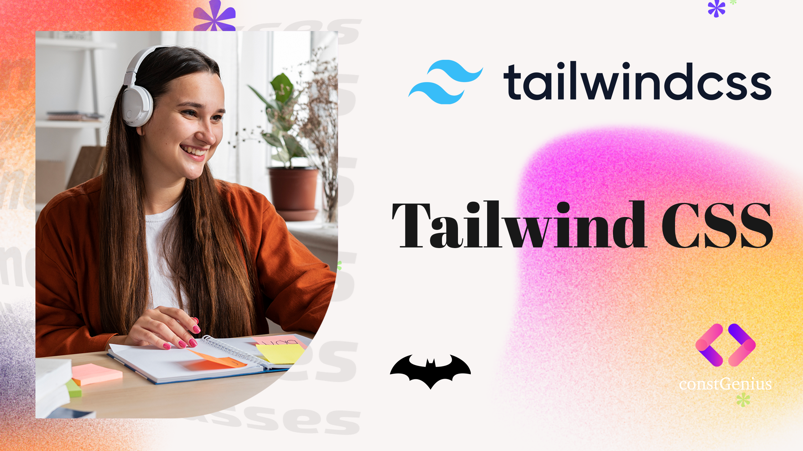

# Tailwind CSS Tutorial

Welcome to the Tailwind CSS tutorial! In this tutorial, you will learn how to use Tailwind CSS to quickly and efficiently build responsive and stylish web interfaces. Tailwind CSS is a utility-first CSS framework that provides a set of pre-designed utility classes that you can use to build your web UI.

